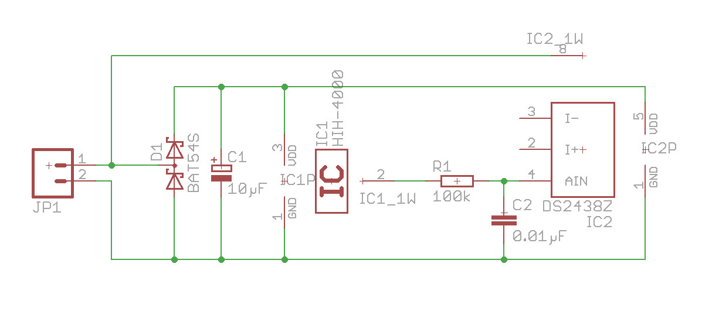
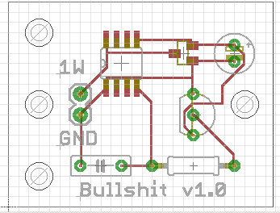
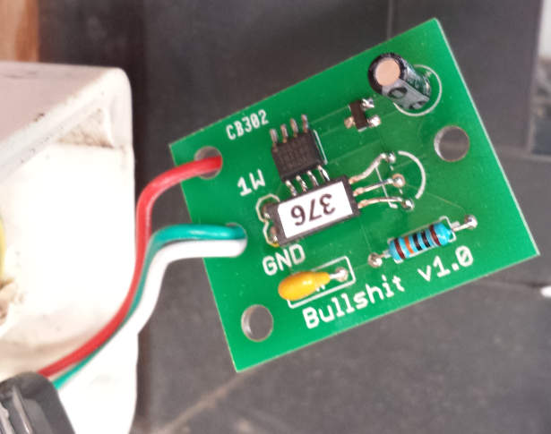

# One-wire humidity sensor

This module is a temperature and humidity sensors on 1-wire bus. It uses an Honeywell HIH-4000 analog humidity sensor and a DS2438 for the A/D conversion and the 1-wire protocol.

## Schematics

## Component list

|C1|10µF capacitor|
|C2|0.01µF capacitor|
|D1|Schottky diode BAT54S|
|IC1|Honeywell HIH-4000|
|IC2|DS2438|
|R1|100kΩ resistor|

## Power

This module is design to run on parasit power. If you want to run it on external power, connect your +5v line to the positive lead of the C1 capacitor.

## References 

 - https://www.rosset.org/linux/humidity/howto1.html
 - http://midondesign.com/Documents/1-WireHumiditySensor.PDF
 - https://skyboo.net/2017/03/ds2438-based-1-wire-humidity-sensor/
 - https://www.fierceelectronics.com/components/a-1-wire-humidity-sensor
